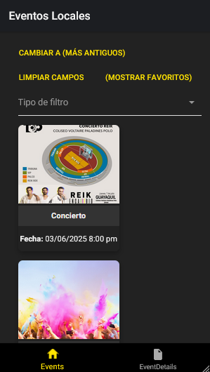
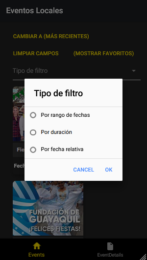
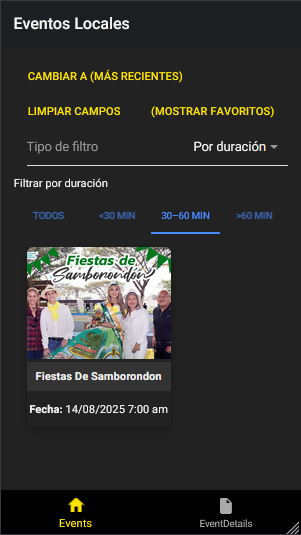
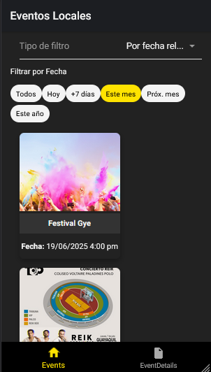
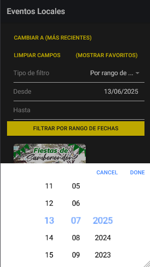
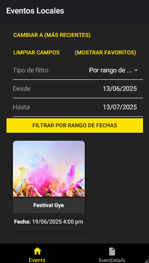
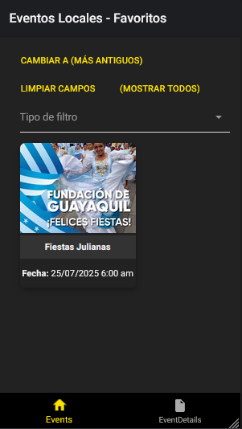
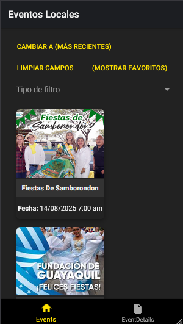
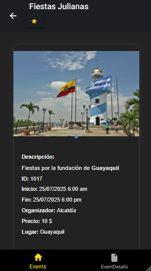
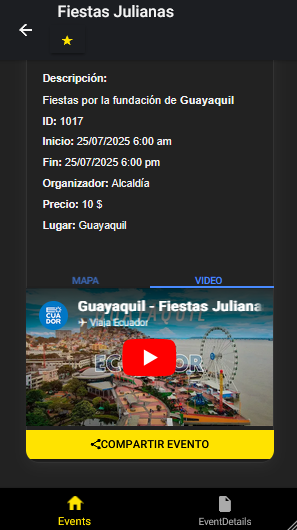

# 📱 Proyecto Ionic 3: [Local Events Agenda]

Este proyecto fue desarrollado con **Ionic 3** y Angular. Incluye características como integración con Google Maps, videos de YouTube embebidos, y funcionalidades nativas como compartir contenido.

---

## 🧰 Tecnologías utilizadas

- **Ionic Framework v3.9.x**
- **Angular 5**
- **TypeScript**
- **WordPress REST API**
- **Moment.js** para manejo de fechas
- **Google Maps JavaScript API**
- **Cordova Plugins**:
  - `@ionic-native/social-sharing`
  - `@ionic-native/geolocation` *(opcional)*
- HTML5 / CSS3

---

## 📦 Requisitos

- Node.js v10 - v14 (versión compatible con Ionic 3)
- NPM
- Ionic CLI 3 (`npm install -g ionic@3.20.1`)
- Cordova CLI (`npm install cordova@10.0.0`)

---

## 🚀 Instalación

Clona el repositorio:

```bash
git clone https://github.com/tu_usuario/mi-proyecto-ionic3.git
cd mi-proyecto-ionic3
```

Instala las dependencias:
```bash
npm install
```

Instalar cordova:
```bash
npm install cordova@10.0.0
npm install cordova-lib@10
ionic integrations enable cordova
```

Instalar plugins de cordova:

```bash
// Plugin para la geolocalizacion:
ionic cordova plugin add cordova-plugin-geolocation@4.1.0
npm install --save @ionic-native/geolocation@4.1.0

// Para compartir eventos:
ionic cordova plugin add cordova-plugin-x-socialsharing@4.1.0
npm install @ionic-native/social-sharing@4.1.0

// Plugin para enviar correos
ionic cordova plugin add cordova-plugin-email
npm install @ionic-native/email-composer@4.20
```
## 🔗 Configurar conexión con WordPress local
Este proyecto se conecta a un backend de WordPress ubicado en tu máquina local. Asegúrate de que esté corriendo en:
```bash
http://localhost:8080/wordpress
```

## 🧪 Modo de desarrollo
Para ejecutar la app en el navegador:
```bash
ionic serve
```

## 📱 Ejecutar en dispositivo Android (o emulador)
```bash
ionic cordova platform add android
ionic cordova run android
```

## 📦 Compilar para producción
```bash
ionic build --prod
```

Construir plataforma para simular en android:
```bash
ionic cordova platform add android@13.0.0
ionic cordova build android
ionic cordova platform rm android (Usar para eliminar la plataforma y volverla a crear)
```


## 📸 Cómo funciona y cómo se ve la app

### 🔍 Funcionalidades principales

- **Listado de eventos**: consume eventos desde una API de WordPress.
- **Detalles del evento**:
  - Título, descripción, imagen destacada.
  - Mapa con la ubicación del evento (usando Google Maps).
  - Video de YouTube embebido (si aplica).
  - Cálculo de duración usando Moment.js.
- **Favoritos**: permite guardar eventos favoritos en almacenamiento local.
- **Compartir evento**: mediante redes sociales o apps compatibles.
- **Vista segmentada**: el usuario puede cambiar entre descripción, ubicación y multimedia.

---

### 🖼 Capturas reales de la app

#### 🏠 Página de inicio


#### 📂 Filtros disponibles
- Tipo de filtro seleccionado:
  

- Filtro por duración:
  

- Filtro por fecha:
  

- Rango de fechas:
  

- Resultado del filtro por rango de fechas:
  

#### ⭐ Favoritos


#### 📅 Orden por más antiguos/recientes


#### 🗂 Detalle del evento


#### 📹 Detalle con video de YouTube



---

### 🚀 Flujo de uso

1. El usuario abre la app y se conecta a la API de WordPress.
2. Se cargan los eventos disponibles y se muestran en una lista.
3. Al hacer clic en un evento, se muestra su detalle:
   - Puedes alternar entre secciones (mapa, video, descripción).
4. El usuario puede marcarlo como favorito, compartirlo o ver su ubicación.

---


